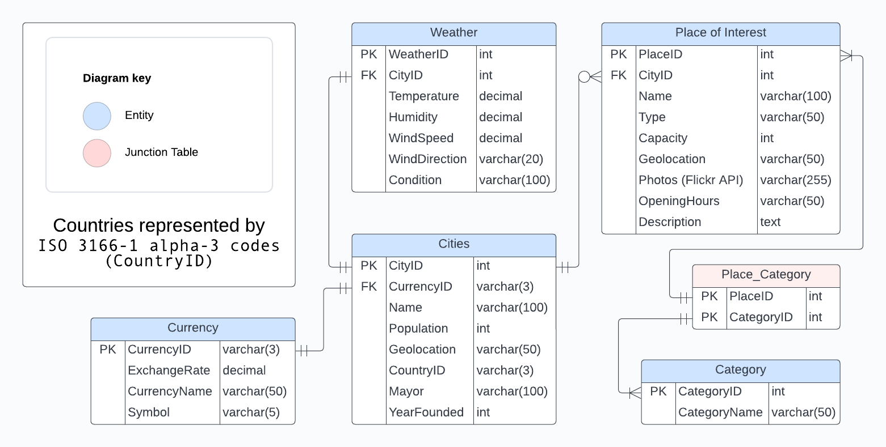

# docker-LAMP
experiment running a LAMP-stack with docker

## How to run db
1. Install docker
2. Clone this repo
3. Run 'docker compose up -d' in root
4. Add Google and OpenWeatherMap API keys to config.php
5. 'docker exec -it lamp-db mariadb -u root - p' and enter password

## Twin Cities Logical Diagram

