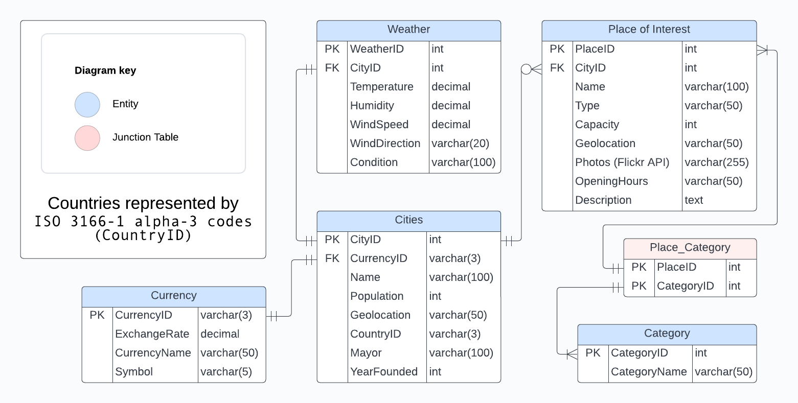

# docker-LAMP
experiment running a LAMP-stack with docker

## How to run db
1. Install docker
2. Clone this repo
3. Run 'docker compose up -d' in root
4. Add Google and OpenWeatherMap API keys to config.php
5. Copy executable .sql script to container ---  "docker cp init-db-twin.sql lamp-db:/init-db-twin.sql"
7. Access mariadb shell ---  "docker exec -it lamp-db mariadb -u root - p" and enter password (zebra)
8. CREATE DATABASE twin_cities;
9. USE twin_cities;
10. source /init-db-twin.sql;
11. Execute INSERT statements

## Twin Cities Logical Diagram

## Twin Cities Map API with Icons, MouseOver Event (from db)

